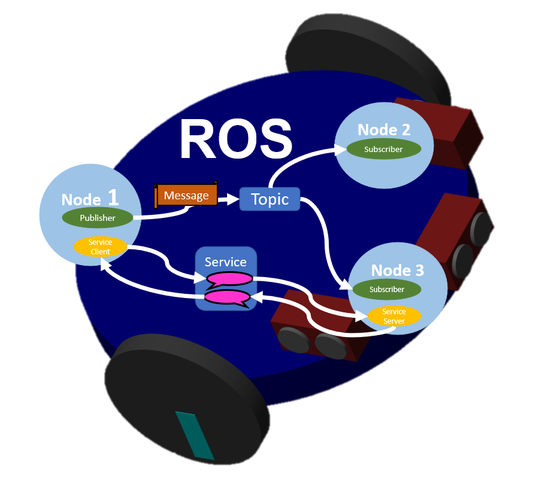
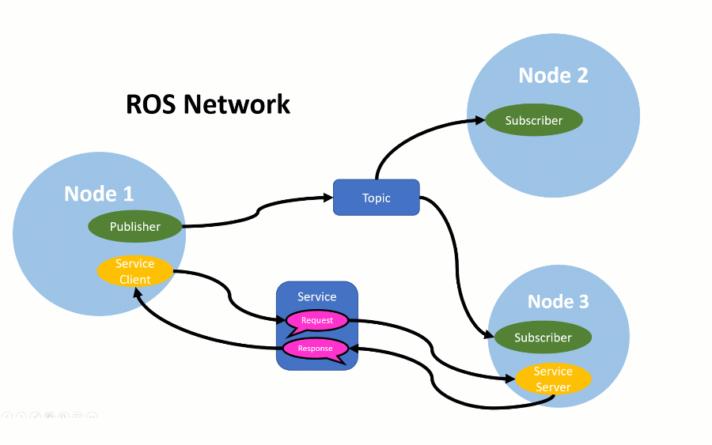

# MATLAB&reg; and Simulink&reg; ROS&trade; Tutorials

This is a set of interactive online tutorials teaching the basics of using ROS (Robot Operating System) to develop and program robots. Open these tutorials in either MATLAB or MATLAB Online to learn more about ROS, and get hands-on experience interacting with robots powered by ROS.

## Content

- 9 Interactive Lessons
- 4 Practice Programming Projects
- 1.5 Hours estimated time to completion

## Tutorials

1. What is ROS? Why use ROS? How to use ROS?
2. Exploring ROS Networks
3. Understanding ROS Messages and Topics
4. Using ROS Subscribers
5. Using ROS Publishers
6. Project - Control Robot to Navigate Maze
7. Using ROS Services
8. Interact with ROS powered Robots from Simulink and Stateflow
9. Intro to rosbags, Node deployment, and Custom Messages

### [MathWorks Products](http://www.mathworks.com)

Requires MATLAB release R2022a or newer
- [MATLAB](https://www.mathworks.com/products/matlab.html)
- [Simulink&reg;](https://www.mathworks.com/products/simulink.html)
- [ROS Toolbox](https://www.mathworks.com/products/ros.html)
- [Simscape&trade; Multibody&trade;](https://www.mathworks.com/products/simscape-multibody.html)

## Getting Started 

Click to open ROSBasicsIndex.mlx in MATLAB Online

## Community Support
[MATLAB Central](https://www.mathworks.com/matlabcentral)

Email: roboticsarena@mathworks.com

Copyright 2022 The MathWorks, Inc.

